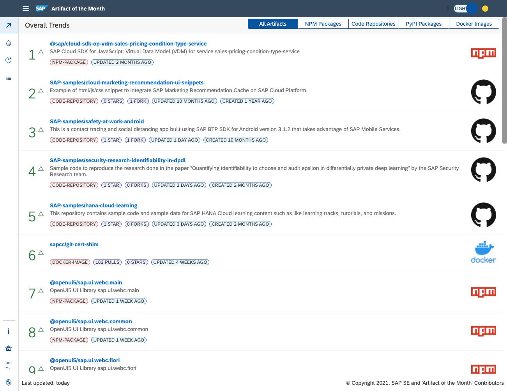

# Artifact of the Month

[![Build Status][test-image]][test-url]
[![REUSE status][reuse-image]][reuse-url]

## Description

Over the past few years, there has been a clear trend that SAP embraces open-source technologies more and more. This means that SAP leverages open-source technologies like Cloud Foundry and Kubernetes in its offerings and that SAP technologies become embeddable on open-source platforms. This development brings a need for a growing number of utility packages that support developers, such as database clients, authentication libraries, scaffoldings tools, and many more. All these packages make the life of developers easier but staying ahead of the curve and being aware of all available packages can also be an additional burden. Therefore, we want to introduce you to a new open-source project that ranks the popularity of all kinds of development artifacts monthly: 

[**The Artifact of the Month**](https://sap-samples.github.io/artifact-of-the-month/).

<a href="https://sap-samples.github.io/artifact-of-the-month/" target="_blank">

</a>


Click the screenshot above to jump directly to the running web app to see the sample live. In case you are curious about the code itself, [continue reading here](https://blogs.sap.com/2021/08/24/introducing-the-artifact-of-the-month/). 


## Requirements

Make sure to have [Node.js LTS version 14](https://nodejs.org/en/download) (or higher) installed

## Download and Installation

If you are interested, you could also run the application locally. For this, you need to clone the repo and install its dependencies.

```
git clone https://github.com/SAP-samples/artifact-of-the-month
cd artifact-of-the-month
npm install
```

Some usage data can be downloaded anonymously, while others can only be consumed with an API key. The [GitHub API](https://docs.github.com/en/github/authenticating-to-github/keeping-your-account-and-data-secure/creating-a-personal-access-token) and [Google BigQuery](https://www.progress.com/tutorials/odbc/a-complete-guide-for-google-bigquery-authentication) table are examples of the later ones. Once you have provisioned the keys for these providers, create a `analyzer/.env` file with the following content:

```
GITHUB_TOKEN=ghp_<token>
GOOGLE_CLOUD_PROJECT=<project id>
GOOGLE_APPLICATION_CREDENTIALS=<path to the key file>
```

> Be aware that the usage of the BigQuery API is not for free and will results in some costs in your GCP account. If you just want to test locally and don't neet the PyPI data, remove the [PyPI export line](analyzer/src/providers/index.ts#L7)

And make sure that the service key is stored in the referenced file. Now, you can run the following commands to fetch the latest data, calculate the ranking, and start the development server locally:

```
npm run fetch
npm run analyze
npm start
```

## Known Issues
None so far.

## How to obtain support

[Create an issue](https://github.com/SAP-samples/<repository-name>/issues) in this repository if you find a bug or have questions about the content.

## Contributing

Do you know of an SAP-related development artifact that isn't listed here but should be? Then feel free to open a PR to add this package, image or whatever to our crawler.


## License
Copyright (c) 2021 SAP SE or an SAP affiliate company. All rights reserved. This project is licensed under the Apache Software License, version 2.0 except as noted otherwise in the [LICENSE](LICENSES/Apache-2.0.txt) file.


[test-image]: https://github.com/SAP-samples/artifact-of-the-month/actions/workflows/main.yaml/badge.svg
[test-url]: https://github.com/SAP-samples/artifact-of-the-month/actions/workflows/main.yaml
[reuse-image]: https://api.reuse.software/badge/github.com/SAP-samples/artifact-of-the-month
[reuse-url]: https://api.reuse.software/info/github.com/SAP-samples/artifact-of-the-month
